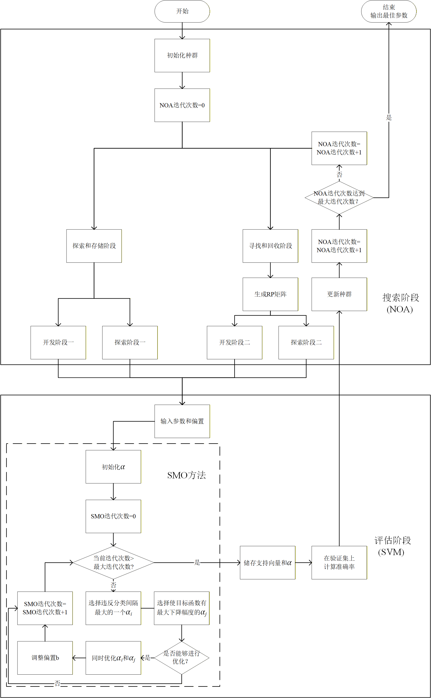

## NOA-SVM：基于星鸦优化算法的自适应支持向量机分类器

本项目提出了一种创新的分类算法 **NOA-SVM** (Nutcracker Optimization Algorithm - Support Vector Machine)，旨在解决传统支持向量机（SVM）在参数选择和特征权重分配上的局限性。

传统的 SVM 性能高度依赖于**软间隔惩罚参数 $C$** 和**核函数参数 $\gamma$** 的选择，且缺乏内在的**特征加权调整**能力。参数选择不当或特征一视同仁可能导致欠拟合或过拟合，影响分类性能。

NOA-SVM 将新兴的**星鸦优化算法 (Nutcracker Optimization Algorithm, NOA)** 引入，构建了一个智能化的优化框架，用于同时寻找最优的 SVM 关键参数和特征加权系数，从而显著提升模型的分类准确率和鲁棒性。

 

NOA原论文：[Nutcracker optimizer: A novel nature-inspired metaheuristic algorithm for global optimization and engineering design problems](https://www.sciencedirect.com/science/article/pii/S0950705122013442)

机器学习课程设计 作业
